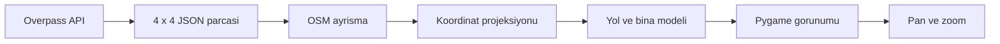

# Ankara Map Renderer

Ankara'nin yollarini, bina ayak izlerini ve serit detaylarini OpenStreetMap verisiyle pygame uzerinde gosteren etkilesimli bir harita renderer'i.

> Proje su anda Ankara'nin yaklasik 50 x 50 km'lik bir alanini hedefler. Veriler 4 x 4 parcaya ayrilarak indirilir ve yerel JSON dosyalari olarak onbelleklenir.

## Neler Sunuyor?

- OpenStreetMap Overpass API'den yol ve bina verisi indirme
- Veriyi 16 parcaya bolup yerel `ankara_chunks/` klasorunde saklama
- Mercator projeksiyonu ile koordinatlari pygame ekranina aktarma
- Yol tipine ve serit sayisina gore yol govdesi ve serit cizgileri
- Kopru ve tuneller icin ayri gorunum katmanlari
- Sanayi, konut ve diger bina kategorileri icin farkli renkler
- Gorus alani disindaki nesneleri atlayan viewport culling optimizasyonu
- Fare ile pan ve zoom

## Ekran Goruntusu

Renderer'i calistirdiginizda koyu temali, seritleri ve bina yogunlugunu ayirt etmeye odaklanan bir Ankara haritasi gorunumu acilir.

## Kurulum

Python 3.9 veya daha yeni bir Python surumu onerilir.

### 1. Repoyu klonlayin

```bash
git clone https://github.com/ayurekli024/ankara-map.git
cd ankara-map
```

### 2. Sanal ortami etkinlestirin

Windows PowerShell:

```powershell
python -m venv .venv
.\.venv\Scripts\Activate.ps1
```

Windows komut istemi:

```bat
python -m venv .venv
.venv\Scripts\activate
```

### 3. Bagimliliklari yukleyin

```bash
python -m pip install --upgrade pip
python -m pip install pygame requests
```

## Calistirma

```bash
python map_lane_renderer.py
```

Ilk calistirmada program eksik parcalari Overpass API'den indirir. Her parca sonrasinda sunucuyu korumak icin bekleme uygulandigindan bu adim zaman alabilir. Daha sonraki calistirmalarda mevcut parcalar `ankara_chunks/` klasorunden okunur.

## Kontroller

| Islem | Kontrol |
| --- | --- |
| Haritayi tasima | Sol fare tusuna basili tutup surukleyin |
| Yaklasma | Fare tekerlegi yukari |
| Uzaklasma | Fare tekerlegi asagi |
| Cikma | Pencereyi kapatin |

Binalar, harita daha yakindan incelendiginde cizilir. Bu davranis, buyuk veri setlerinde baslangic performansini korumak icin kullanilir.

## Proje Yapisi

```text
.
├── map_lane_renderer.py       # Veri indirme, ayrisma ve pygame renderer'i
├── ankara_chunks/             # 4 x 4 OSM parcasi icin yerel onbellek
├── ankara_50x50_tum_yollar.json
├── ankara_50x50_yollar.json
├── ankara_genis_yollar.json
├── kizilay_roads.json
└── ostim_batikent_binalar.json
```

## Teknik Akis



### Veri isleme

1. Ankara sinirlari `BBOX` ile tanimlanir.
2. BBOX, `GRID_SIZE = 4` ile 16 parcaya bolunur.
3. Her parca icin `highway` ve `building` etiketli OSM nesneleri sorgulanir.
4. Tekrarlanan way kayitlari ID'leriyle elenir.
5. Enlem ve boylam degerleri Mercator projeksiyonuyla ekran koordinatlarina donusturulur.
6. Yol seritleri, kenarlari, kopruleri ve tunelleri katmanli olarak cizilir.

## Ayarlanabilir Degerler

`map_lane_renderer.py` dosyasinin basindaki ayarlar projenin temel davranisini kontrol eder:

```python
BBOX = [39.6950, 32.5600, 40.1450, 33.1480]
SCREEN_WIDTH = 1500
SCREEN_HEIGHT = 700
FPS = 60
GRID_SIZE = 4
CACHE_DIR = "ankara_chunks"
```

- Daha kucuk bir alan icin `BBOX` degerini daraltabilirsiniz.
- Daha fazla veya daha az veri parcasi icin `GRID_SIZE` degerini degistirebilirsiniz.
- `CACHE_DIR` altindaki dosyalar silinirse eksik veriler bir sonraki calistirmada yeniden indirilir.

## OSM ve Overpass Notu

Veri OpenStreetMap uzerinden, Overpass API araciligiyla alinmaktadir. OSM verisini yeniden dagitir veya bu projeyi yayimlarsaniz OpenStreetMap ve katki saglayanlari uygun sekilde belirtin.

- OpenStreetMap: https://www.openstreetmap.org/copyright
- Overpass API: https://overpass-api.de/

## Bilinen Sinirlamalar

- Ilk veri indirme suresi Overpass API yogunluguna ve internet baglantisina baglidir.
- Her yol ve bina geometrisi icin tum detaylar kullanilmaz; renderer gorunurluk ve performansa odaklanir.
- Harita verisi zamanla degisebilir. Onbellekteki JSON dosyalari indirme anindaki veriyi temsil eder.

## Lisans

Bu repoda ayri bir lisans dosyasi bulunmadigi icin kullanim ve yeniden dagitim kosullari icin repository sahibinden izin alinmasi gerekir. OSM verisi icin Open Database License kosullarini inceleyin.
